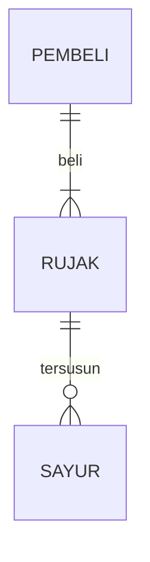

## 1. Latar Belakang
Game ini dibuat untuk memenuhi salah satu tugas pada mata kuliah Praktikum Dasar Pemograman sebagai tugas Ulanagan Tengah Semester (UTS). Inspirasi saya membuat game ini karena terinspirasi dari keseharian saya sebagai seorang mahasiswa yang sehari-harinya harus mengumpulkan tugas-tugas, semakin banyak tugas yang dikumpulkan maka semakin besar juga nilai yang didapatkan.
## 2. Deksripsi dan alur cerita game
Didalam game ini terdapat satu orang player sebagai mahasiswa yang harus mengumpulkan tugas sebanyak-banyaknya sebelum waktu habis, titik-titik sebanyak 50 buah sebagai tugas yang harus dikumpulkan, tampilan timer yang dimulai dari 0 detik sampai 100 detik, tampilan papan skor yang dimana setiap 1 tugas yang dikumpulkan bernilai 2 berarti jika semua tugas berhasil dikumpulkan bernilai 100.
## 3. Branding game
- Nama Game = Dikejar Deadline 
- Tareget pengguna =
  - Game ini bisa dimainkan dari kalangan anak-anak sampai dewasa
- Genre 
## 4. User Story
Sebagai | Saya ingin bisa | Sehingga | Prioritas
---|---|---|---
Pengguna | Menggerakan player | Player bisa bergerak | ⭐⭐⭐⭐⭐
Pengguna | Mengambil objek | Player bisa mengumpulkan objek |  ⭐⭐⭐⭐⭐
Sistem | Set timer | Bisa set timer kapan game dimulai dan berakhir | ⭐⭐⭐⭐
## 3. Struktur Data
Cara membuat aneka macam bentuk grafik menggunakan mermaid.js bisa lihat di [https://mermaid.js.org/syntax/entityRelationshipDiagram.html](https://mermaid.js.org/syntax/entityRelationshipDiagram.html) 

## 4. Arsitektur Sistem
'''mermaid
flowchart TD;
A [Start]--->B[Process 1];
B--->C[Process 2];
C--->D[End];
'''

## 5. Teknologi, Library, dan Framework

bla bla bla

## 6. Desain User Experience dan User Interface

Bisa load image 

## 7. Demonstrasi Video

Link youtube nya

## 8. Bagaimana mesin komputasi dan sistem operasi berperan dalam produk teknologi informasimu ?

Link youtube nya di detik jawaban ini

## 9. Bagaimana algoritma, struktur data, dan bahasa pemrograman berperan dalam produk teknologi informasimu ?

Link youtube nya di detik jawaban ini

## 10. Bagaimana metode pengembangan perangkat lunak / Software Development Life Cycle berperan dalam produk teknologi informasimu ?

Link youtube nya di detik jawaban ini

## 11. Bagaimana database / sistem basis data berperan dalam produk teknologi informasimu ?

Link youtube nya di detik jawaban ini
